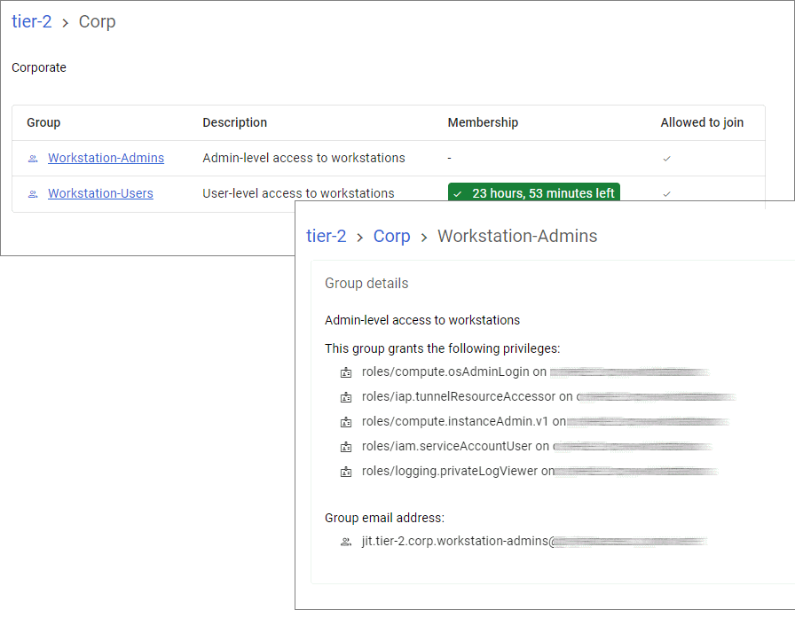
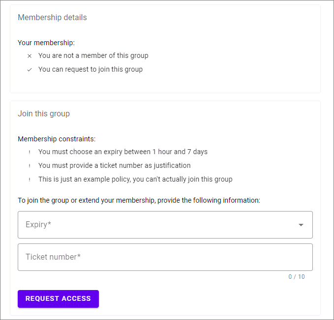

# JIT Groups Preview

JIT Groups is an open source application that lets you implement secure, self-service
access management for Google Cloud using security groups.

!!! note ""

    JIT Groups supersedes the [JIT Access](jitaccess-overview.md) project, which has largely outlived its purpose as
    privileged access management
    [is now available as a platform feature in Google Cloud :octicons-link-external-16:](https://cloud.google.com/iam/docs/pam-overview).
    JIT Groups addresses an adjacent, but different use case -- self-service
    access management, or _entitlement management_, for all types of Google Cloud access, not only privileged access. 

    If you're currently using JIT Access, you can continue to do so. But we encourage you to consider 
    [upgrading to JIT Groups](jitaccess-upgrade.md) or migrating to PAM.

## Bundle access by job function

**As a user**, you often need a combination of IAM roles to perform a certain job function or role,
and you might also need access to more than a single project.

**As an administrator**, you can use JIT Groups to create _access bundles_ -- groups that combine all
access required to perform a certain job function or role -- and let the application automate the
process of creating the groups and provisioning the necessary IAM policies.

## Let users discover groups and access

[{ width="350" align="right"  }](images/jitgroups-discover.png)

**As a user**, you can browse and discover available groups in a self-service fashion.

**As an administrator**, you can control which groups users are allowed to discover and join, 
and which conditions they need to meet to join individual groups.

## Let users activate time-bound access 

[{ width="300" align="right"  }](images/jitgroups-groupdetails.png)

**As a user**, you can join a group to obtain time-bound access to Google Cloud resources.

**As an administrator**, you can decide whether users need approval to join a group, or whether they're
allowed to join without approval. You can also control the time period for which access is granted, and which
additional constraints users need to satisfy.

## Use GitOps to manage groups and policies

{ width="450" align="right"  }

**As an administrator**, you manage groups and their settings using [policy documents](policy-reference.md),
which are YAML documents. 

You can use a GitOps workflow to manage and deploy these policy documents, similar to how
you manage your infrastructure as code.

**As a user**, you can use the JIT Groups web interface to discover and join groups, and to approve
other user's join requests -- no code or Git knowledge required.

## Secure your groups

JIT Groups uses Cloud Identity [security groups :octicons-link-external-16:](https://support.google.com/a/answer/10607394) and 
[adjusts their settings :octicons-link-external-16:](https://support.google.com/groups/answer/2464926?hl=en#advanced)
to make them safe for use in Cloud IAM allow policies, deny policies, and permission access boundaries.

Using security groups is a step up from using _discussion forum_ groups, which provisioning tools such as 
Entra ID and Okta typically use. While discussion forum groups are suitable for managing _organizational groups_,
they provide fewer security safeguards than security groups and are therefore not well-suited for managing access to
resources.

## Separate organizational groups and security groups

JIT Groups can help you separate organizational groups and security groups:

+   **Organizational groups** are groups that model the organizational structure, and they're often based on 
    departments, teams, or reporting structures. You can continue to manage these groups using Entra ID, Okta, 
    or an HRIS and provision them to Cloud Identity.

{ width="450" align="right"  }

+   **Security groups** are groups that model job functions or roles, and they're used to control access to 
    resources. 

    You can let JIT Groups manage these groups, and control which users and organizational groups
    are allowed to join them.

## Audit group membership

**As an administrator or auditor**, you can use Cloud Logging to review the JIT Groups audit log. The audit log tracks all events
related to users joining groups or approving membership requests and contains detailed information about:

* the user's identity
* the affected group
* the information provided by the user, such as a justification or ticket number
* the user's device, including satisfied [access levels :octicons-link-external-16:](https://cloud.google.com/access-context-manager/docs/manage-access-levels)

## Deploy on App Engine or Cloud Run

JIT Groups is a Java application and runs on App Engine (standard) and Cloud Run. The application
is stateless and uses [Identity-Aware-Proxy :octicons-link-external-16:](https://cloud.google.com/iap/docs/concepts-overview)
for authentication and authorization, and the [Cloud Identity API :octicons-link-external-16:](https://cloud.google.com/identity/docs/reference/rest) and
[IAM API :octicons-link-external-16:](https://cloud.google.com/iam/docs/reference/rest) to manage groups and access.

For detailed instructions on deploying Just-In-Time Access, see [Deploy JIT Groups](jitgroups-deploy.md).

## What's next 

[More about the concepts behind JIT Groups :material-arrow-right:](jitgroups-concepts.md){ .md-button }