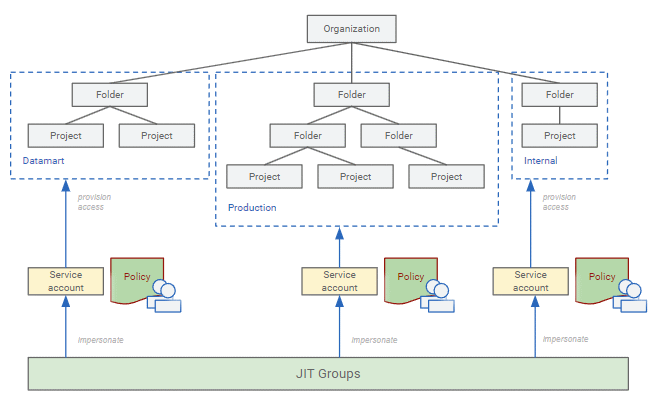

This articles explains _JIT groups_ and _Environments_, two key concepts used by JIT Groups.

## JIT group

A JIT group represents a job function or role, for example _prod-network-admins_ or _finance-datamart-readers_.
The group bundles the IAM role bindings that users need to perform this job function or role, and defines
the subset of users that are allowed to _join_ the group.

As their name indicates, JIT groups are intended to be joined just-in-time:  

+   As an administrator, you don't grant access to JIT groups on demand, just because users _might_ need certain access.
+   Instead, you entitle users to join the group _just-in-time, when they need it_.

Membership if a JIT group is always time-bound:

+   Each group defines an _expiry_, for example 90 days. After joining a JIT group, users remain a member, and retain
    access for this time period. Once the time period expires, they're automatically removed from the group.
+   Within the expiry period, users can keep extending their access.

By making all memberships time-bound, JIT Groups lets you flip incentives:

+   Without JIT Groups, users are incentivized to accumulate access, because revoking access incurs friction.
+   With JIT Groups, users are **dis-incentivized** to accumulate access, because retaining access incurs friction while
    revoking access is automatic.

### Policy

JIT groups are defined in code, and a simple JIT group policy might look like the following:

```yaml
- name: "Server-Admins"
  description: "Admin-level access to servers"
  
  # Who can view, join, approve?
  access:
    # Ann can join and doesn't need approval from anyone
    - principal: "user:ann@example.com"
      allow: "JOIN, APPROVE_SELF"
      
    # Ben can also join and approve other's requests to join the group
    - principal: "user:ben@example.com"
      allow: "JOIN, APPROVE_SELF, APPROVE_OTHERS"
      
    # Everybody in the managers group can approve requests, but can't join themselves
    - principal: "group:managers@example.com"
      allow: "APPROVE_OTHERS"
      
  # Which constraints apply when joining this group?
  constraints:
    join:
      # Let users chose an expiry between 1 and 24 hours
      - type: "expiry"
        min: "PT1H"
        max: "PT24H"
        
  # What does the group grant access to?
  privileges:
    iam:
      # Some roles on sample-project-1
      - project: "sample-project-1"
        role: "roles/compute.osAdminLogin"
      - project: "sample-project-1"
        role: "roles/iap.tunnelResourceAccessor"
      - project: "sample-project-1"
        role: "roles/compute.instanceAdmin.v1"
        
      # A few more roles on sample-project-2
      - project: "sample-project-2"
        role: "roles/iap.tunnelResourceAccessor"
      - project: "sample-project-2"
        role: "roles/compute.instanceAdmin.v1"
```

+   The [`access` section](policy-reference.md#access-control-list) contains an access control list
    that defines who is allowed to join the group, 
    and whether they need approval to do so.
+   The [`constraints` section](policy-reference.md#constraint) defines what additional constraints apply 
    when joining the group.
+   The [`privileges` section](policy-reference.md#privilege) defines what access members of the groups are granted.

### Provisioning 

The first time a user joins a JIT group, the application provisions the following:

+   A [Cloud Identity security group :octicons-link-external-16:](https://cloud.google.com/identity/docs/how-to/update-group-to-security-group)
    that corresponds to the JIT group. 
+   IAM role bindings that grant the Cloud Identity security group access to Cloud resources, based on what's defined
    in the policy document.
+   A time-bound membership for the user.

You can identify JIT groups in the Admin Console based on their `jit.` prefix.

## Environment

JIT groups and their policies aren't managed in isolation. Instead, each JIT group belongs to an _environment_. 

An environment represents a segment of your Google Cloud organizational hierarchy. You can use a single environment
for all your Google Cloud projects, but especially in larger organizations, it can be better to have multiple environments
and delegate the management of each environment to different teams or business units.

For each environment, JIT Access maintains:

+   A [policy document](policy-reference.md) that defines the groups for this environment, stored in a 
    Secret Manger secret.
+   A service account that's used to provision IAM bindings for resources in this environment.

To access the policy document, JIT Groups first
[impersonates :octicons-link-external-16:](https://cloud.google.com/iam/docs/service-account-impersonation)
the environment's service account, and then reads the document from the environment's Secret Manger secret.

Similarly, to provision IAM bindings for the environment, JIT Groups impersonates the environment's service account,
and then uses that service account's identity to modify the IAM bindings.




Using different service accounts for each environment helps isolate environments from another, and helps
ensure that no single service account has direct access to all resources.


### Policy document

To add or change the configuration of a JIT group, you modify the policy document that's stored in the
Secret Manger secret. The changes then take effect with a short delay, typically less than a minute.

Because policy documents are YAML files, they're well suited to be managed using a GitOps workflow
where you do the following:

+   You store the policy document in a Git repository.
+   You use a code review process for all proposed policy changes.
+   You let a CI/CD system (such as GitHub Actions) apply change by updating the Secret Manager secret.

### Reconciliation

Over time, the policy document, the Cloud Identity security groups, and their IAM bindings might go
out of sync. JIT Groups deals with this challenge as follows:

+   Whenever a user joins a JIT group, the application checks whether the [`privileges` section](policy-reference.md#privilege) 
    of the group's policy has changed, and updates IAM bindings if necessary.
+   At any point in time, administrators (that is, users with [`RECONCILE` access](policy-reference.md#access-control-list)
    to the environment) can use the web interface to _reconcile_ the policy.
   
On reconciliation, JIT Groups performs the following:

+   Find Cloud Identity groups that are no longer covered by the policy
+   Update IAM policy bindings if the `privileges` section of the policy has changed
+   Detect legacy roles that can't be mapped to JIT groups

The application reports any issues it encounters so that you can take action manually.

## What's next

+   Read more about the [format of policy documents](policy-reference.md).